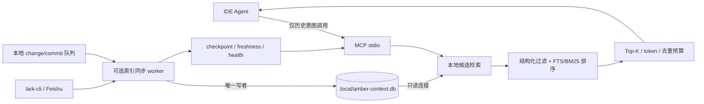

# Amber MCP 耗时优化计划

## 1. 结论与设计依据

- 在计划文档中引用现有双盲结论：[双盲测试报告](D:/project/Amber/docs/琥珀计划第三阶段-MCP双盲测试报告.html) 已证明质量从 90/100 提升到 100/100，但总耗时增加 38.2%；“门控可回收约 55.2% 增量耗时”只作为本轮样本的方向性估计，不作为收益承诺。
- 说明当前瓶颈：[task-context.mjs](D:/project/Amber/scripts/lib/task-context.mjs) 在冷请求中并行等待两个 `lark-cli` 查询，缓存仅为约 60 秒、进程内、精确请求缓存；本地队列仅在远端失败或空结果时兜底。
- 复核并记录 CodeGraph 的可借鉴机制：
  - `init` 预建本地 SQLite，watcher/CLI/MCP catch-up 汇入统一增量同步。
  - 轻量 MCP 会话共享长期 engine、SQLite WAL、watcher 和单写者；并发重查询才使用 worker pool。
  - `codegraph_explore` 有严格上下文预算，并按会话和文件指纹去重已返回源码。
  - 工具面及调用规则刻意保持单一、明确。
  - 源码依据：[engine.ts](https://github.com/colbymchenry/codegraph/blob/main/src/mcp/engine.ts)、[explore-dedup.ts](https://github.com/colbymchenry/codegraph/blob/main/src/mcp/explore-dedup.ts)、[watcher.ts](https://github.com/colbymchenry/codegraph/blob/main/src/sync/watcher.ts)、[codegraph.mdc](https://github.com/colbymchenry/codegraph/blob/main/.cursor/rules/codegraph.mdc)。
- 明确不照搬：Amber 不需要 AST/引用图；当前规模不先上查询线程池和 daemon/proxy；未确认 CodeGraph 有通用的相同请求 in-flight 合并或完整 MCP 遥测，这两项如实施应标注为 Amber 自身优化。

## 2. 目标架构

- MCP 查询路径只读本地库，不启动 `lark-cli`、不写索引。
- 后台 worker 负责全量引导、增量同步、周期对账和原子 checkpoint；远端失败只降低新鲜度，不阻塞交互查询。
- 灰度期保留远端 fallback 开关；稳定后默认热路径不等待远端。索引缺失或过期时返回本地证据及 `freshness/coverage`，并由周期 worker 恢复，不在 read-only MCP 调用内排队写状态。

## 3. 快速收益：P0/P1

### P0：先建立可分解基线

- 修改 [mcp-stdio-server.mjs](D:/project/Amber/scripts/mcp-stdio-server.mjs)，为每次调用生成 request ID，测量 MCP 总耗时、状态和序列化后 payload 字节数；所有运行日志进入 stderr 或 `.local`，不得污染 stdio stdout。
- 从 [task-context.mjs](D:/project/Amber/scripts/lib/task-context.mjs) 抽出 `scripts/lib/task-context/metrics.mjs`，记录 AI/commit 两个 `lark-cli` 子进程耗时、进程数、parse/merge/rank/serialize、cache 状态、候选数、证据数和降级原因；指标不记录原始任务文本、token 或敏感字段。
- 将摘要接入 [health.mjs](D:/project/Amber/scripts/lib/health.mjs)，至少暴露调用量、p50/p95、超时率、远端调用数、cache/index 命中率和索引新鲜度。
- 先采集不少于 100 次调用或 3 天，固定 remote baseline，再判断后续收益。

### P1：不改变证据语义的热路径削减

- 收紧 [mcp-stdio-server.mjs](D:/project/Amber/scripts/mcp-stdio-server.mjs) 的工具描述：仅历史原因、旧决定、被否方案、遗留、事故、兼容/回归约束调用；纯当前代码状态默认不调用。门控发生在调用方，服务端和实验记录负责验证调用率，不能假装观测到“未调用事件”。
- 将 [task-context.mjs](D:/project/Amber/scripts/lib/task-context.mjs) 收敛为 facade，并拆分：
  - `scripts/lib/task-context/lark-source.mjs`：远端参数、进程、解析和字段映射。
  - `scripts/lib/task-context/local-queue-source.mjs`：现有队列兜底。
  - `scripts/lib/task-context/cache.mjs`：规范化 key、请求缓存、按 project/table 的数据集缓存、negative cache、stale-while-revalidate、相同数据集请求的 in-flight 合并和并发上限。
  - `scripts/lib/task-context/ranking.mjs`：只做结构化匹配与相关性。
  - `scripts/lib/task-context/evidence.mjs`：只做 v2/v3 输出预算和脱敏。
- 默认 `minimal` 不查询不会进入输出的 commit 表；仅 `compact/full` 查询关联提交。规范化 task 空白、路径大小写和 files 排序，使语义相同请求复用缓存。
- 远端过滤优先使用已验证的精确仓库路径；字段缺失或格式不一致时回退 project 过滤，不能用过窄查询损害历史召回。
- P1 检查点：默认冷请求从 2 个子进程降为 1 个；同项目连续问题复用数据集；相同并发 miss 只发一组远端请求；输出质量和 `no_strong_history` 校准不变。

## 4. 本地优先重构：P2/P3

### P2：SQLite FTS5 索引与单写者同步

- 新增 `scripts/lib/task-context/index-store.mjs`：使用 `node:sqlite`，启动时探测 SQLite/FTS5；配置 WAL、busy timeout、事务 upsert、只读查询和完整性检查。若运行时不支持，保持 remote 模式，不默认引入 Windows 原生 addon。
- 新增 `scripts/lib/task-context/index-schema.mjs`：维护 `records`、`record_files`、change-commit 关联、FTS 和 `sync_state`。每条记录保存 source/table、record ID、canonical repository key、project、branch、task、result、files、occurredAt、payload hash 和 sourceUpdatedAt。
- FTS 字段写入当前中英文 tokenizer 生成的 token 串，避免依赖 FTS5 默认中文分词；查询必须先按 canonical workspace/repository 分区，再做 BM25，防止同名项目串数据。
- 新增 `scripts/lib/task-context/index-sync.mjs` 与 [mcp-context-sync-worker.mjs](D:/project/Amber/scripts/mcp-context-sync-worker.mjs)：
  - 首次分页全量同步两张 Feishu 表。
  - 后续按 watermark + 重叠窗口增量 upsert，并周期全量 reconciliation 修复漏更/删除。
  - 同时吸收 `.local/change-records`、`.local/commit-records`，使刚产生的本地事实尽快可查。
  - checkpoint、heartbeat、错误和统计采用现有健康 worker 的原子写模式。
- 修改 [watch-all.mjs](D:/project/Amber/scripts/watch-all.mjs) 和 [watch-supervisor.mjs](D:/project/Amber/scripts/lib/watch-supervisor.mjs)，在启用时启动 `mcp-index`，并把它定义为 optional：索引故障只告警，不能拖垮 records/commits 核心事实生产链。补充 [package.json](D:/project/Amber/package.json) 的 `mcp:index:once/status/rebuild` 命令。
- MCP 输出升级时只增加紧凑顶层元数据：`freshness`、`coverage`、`source`；保留 `ok / no_strong_history / degraded` 语义和硬输出预算。

### P3：检索精度与会话复用

- 候选排序顺序：exact repository/project → exact task/file/commit → FTS5/BM25 → 现有规则重排；候选上限与最终 evidence 上限分别控制，避免“只降 Top-K”导致召回下降。
- 只有指标证明重复证据占比高时，才增加稳定 `evidence_id` 和 stdio 会话内去重；重复证据用短引用代替，但必须像 CodeGraph 一样保留来源指针，不能静默省略。
- 只有 FTS 在历史依赖样本上达不到召回目标时才评估 embedding/vector；不在首版引入。
- 只有并发指标显示本地 SQLite 查询阻塞 MCP transport 时才评估查询 worker pool 或共享 daemon。

## 5. 验收与测试

- 性能目标：
  - P1 远端 `lark-cli` 子进程总量较 remote baseline 降低至少 50%。
  - local-index 命中时 `lark-cli` 数为 0，warm hit rate ≥ 85%，MCP P95 ≤ 300ms、P99 ≤ 800ms。
  - index age P95 ≤ 60s；5 分钟进入 stale，15 分钟健康告警。
  - incremental end-to-end latency 明显向 no-MCP 基线收敛；目标至少减少本轮新增耗时的 40%，但不承诺 55.2%。
- 质量目标：历史依赖题调用率 ≥ 95%，纯当前状态题调用率 ≤ 25%；配对评分不低于当前 MCP 组；历史证据召回 ≥ 95%，负向样本误召回 ≤ 5%，跨仓库泄漏为 0。
- 负载与输出目标：minimal payload P95 ≤ 8KB；50 个相同并发请求只产生一组远端 source 查询；索引命中并发不写库。
- 扩展 [task-context.test.mjs](D:/project/Amber/test/task-context.test.mjs)，并新增 `test/task-context-cache.test.mjs`、`test/task-context-index.test.mjs`、`test/task-context-metrics.test.mjs`、`test/mcp-context-sync-worker.test.mjs`，覆盖：
  - remote/local 输出等价、minimal 单表查询、缓存/SWR/in-flight 合并。
  - 全量/增量/reconciliation、checkpoint、FTS 排序和仓库隔离。
  - stale、锁冲突、损坏库、超时、单表失败、无 FTS5 等降级路径。
  - stdio 协议、payload 上限、脱敏、health 和 optional supervisor 行为。
- 复用第三阶段配对题，补充无历史负控、同项目不同仓库、历史与当前代码冲突三类样本，分别对比 remote baseline、gated remote、local-index。

## 6. 灰度、回滚与文档交付

- 阶段顺序：remote metrics → 门控 shadow 评估 → gated remote → local-index shadow 比对 → 10%/50%/100% local-first。
- 提供 `AMBER_TASK_CONTEXT_MODE=remote|local-first|local-only|off` 与独立索引 worker 开关；回滚只切回 remote/off 并停用本地索引采用，不删除 SQLite、checkpoint 或指标，便于复盘。
- 任一条件触发回滚：历史召回下降 > 5 个百分点、严重无依据断言 ≥ 1、跨仓库泄漏 ≥ 1、timeout > 5%、P95 持续超过基线 2 倍、索引 stale > 15 分钟且无可靠降级。
- 风险及缓解写入最终文档：watermark 漏更用重叠窗口和周期全量对账；缓存/索引损坏用 integrity check、原子 checkpoint 和 rebuild；仓库碰撞用 canonical repository key；过度门控用 shadow 样本和历史题强制规则；Windows/Node 兼容用 `node:sqlite`/FTS5 能力探测和 remote fallback。
- 最终文档写入 [琥珀计划第三阶段-MCP耗时优化计划.md](D:/project/Amber/docs/琥珀计划第三阶段-MCP耗时优化计划.md)，包含 CodeGraph 对照、现状流、目标架构、P0-P3 工作项、文件清单、指标、测试、灰度/回滚和风险；本轮仅产出计划文档，不直接实施优化代码。