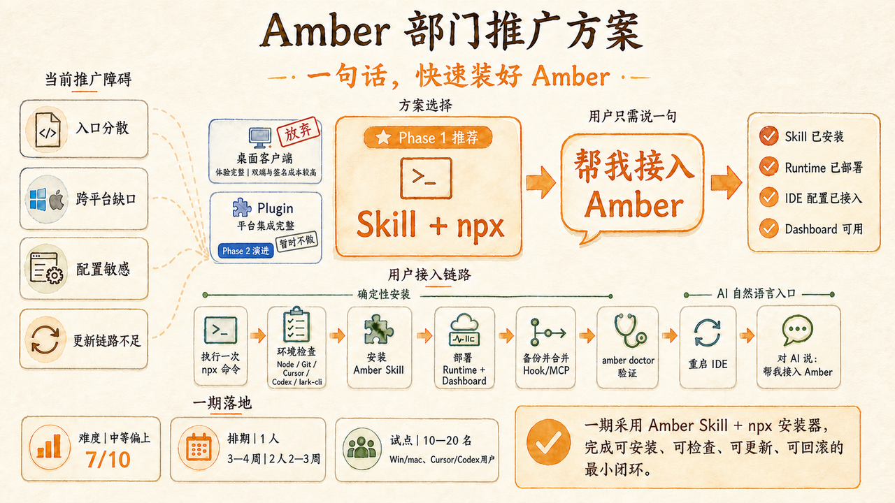
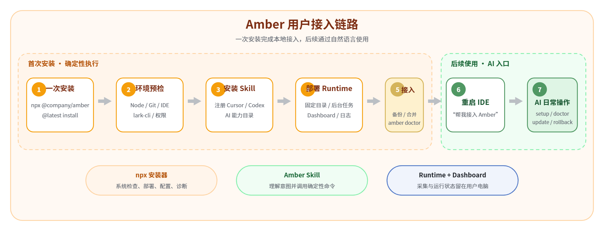

# 一、执行摘要

> Amber 已具备采集、健康监控、变更记录、通知和本地 Dashboard 等核心能力。部门推广的主要工作集中在安装、配置、升级和故障恢复的产品化。

* **一期形态**：Amber Skill + 统一 npx 安装器 + 本地 Runtime + Dashboard。

* **用户入口**：先执行一次安装命令，重启 Cursor/Codex 后即可通过自然语言完成接入、检查、修复和更新。

* **固定目录**：Windows 使用 `%LOCALAPPDATA%\Amber`，macOS 使用 `~/Library/Application Support/Amber`；Git 扫描目录由用户选择。

* **建设难度**：中等偏上，综合评估约 7/10；重点风险位于跨平台路径、IDE 配置安全写入、版本更新和失败回滚。

* **当前建设状态**：Skill 与 npx 安装器尚未落地。仓库现有能力是 Windows Runtime、`team-setup` / `install.bat` 和 ZIP 构建；这些是安装器将复用的本地实现，不是部门用户入口。接入图中的 `npx @company/amber@latest install` 为示意命令。TODO：正式 npm 包名尚未发布。

# 二、背景与当前问题

当前 Amber 以 Node.js ESM 应用运行，Windows 侧已经具备安装、备份、配置合并、后台启动、健康检查和 Dashboard。现有推广方式仍依赖开发者理解目录、命令和 IDE 配置，难以形成面向大部门的统一 SOP。

## 现有基础

* Git、Cursor/Codex、lark-cli 在目标用户群中基本具备；Node.js 版本需要统一到当前项目要求。

* Windows 安装目录已固定为用户级目录，配置备份与运行状态保存在本机。

* 采集器、Watcher、健康监控和 Dashboard 均在用户电脑执行，数据采集范围由 Runtime 代码与部门策略共同限定。

## 推广障碍

> **入口分散**
>
> 用户需要记住脚本、目录、服务和 Dashboard 地址。

> **配置敏感**
>
> Cursor/Codex 已存在个人 Hook、MCP 或其他配置，安装器必须保留原内容。

> **跨平台缺口**
>
> 现有实现以 Windows 为主，macOS 的路径、自启动和权限尚需补齐。

> **更新链路不足**
>
> 复制覆盖会带来版本混用、配置丢失和失败后无法恢复等问题。

# 三、调研情况

## lark-cli 文档与实现原理

官方入口支持通过 `npx @larksuite/cli@latest install` 启动安装向导。

npm 包承担引导职责：识别操作系统与架构、下载对应的预编译 CLI、校验 SHA-256，并执行配置初始化、登录与 Skill 安装。

CLI 提供 JSON 输出、错误码、doctor、schema 和 dry-run 等能力，适合被 AI 或上层安装器稳定调用。

> 这套方式对 Amber 有较高参考价值：将入口、版本选择、校验和诊断统一交给安装器，将本地采集和 Dashboard 留给 Runtime，将自然语言交互留给 Skill。

## Skill 与 Plugin 调研

* **Skill**：寄生在 Cursor/Codex 的 Agent 能力目录中，核心是 `SKILL.md`、脚本和说明。AI 读取 Skill 后调用 Amber 安装器或诊断命令。

* **Plugin**：寄生在具体 AI 平台的插件体系中，可打包 Skill、MCP、App 或命令。Codex 与 Cursor 各有安装与分发机制，内部推广需要分别维护清单、版本和兼容性。

* **npx**：负责执行一个确定的 npm 安装器。它可以安装 Skill，也可以同时下载 Runtime、写入配置和注册后台任务；命令名称本身不等同于 Skill。

调研来源：[larksuite/cli](https://github.com/larksuite/cli)、[install-wizard.js](https://github.com/larksuite/cli/blob/main/scripts/install-wizard.js)、[install.js](https://github.com/larksuite/cli/blob/main/scripts/install.js)、[Codex Plugins](https://learn.chatgpt.com/docs/plugins)、[Cursor Plugins](https://prod.cursor.com/docs/plugins)。

# 四、方案分析与对比

| 方案              | 用户入口            | 优势                                        | 主要成本                              | 一期判断     |
| --------------- | --------------- | ----------------------------------------- | --------------------------------- | -------- |
| **桌面客户端**       | 下载安装包，托盘或窗口操作   | 状态可视、更新统一、Dashboard 可内嵌                   | Win/mac 双端、签名公证、自动更新、UI 与发布体系     | 后续按需建设   |
| **Skill + npx** | 一次安装命令，后续自然语言操作 | AI Native、开发量可控、可复用现有 Runtime 与 Dashboard | 安装器仍需承担路径、配置、更新、回滚和诊断             | **一期推荐** |
| **Plugin**      | 平台插件页、市场或企业分发   | Skill、MCP 和命令可统一打包，发现体验更完整                | Cursor/Codex 平台机制存在差异，审核和版本兼容成本较高 | 二期演进     |

**结论**：一期选择 Skill + npx，可以用较短周期把现有能力包装成可安装、可检查、可更新、可回滚的部门级产品。桌面客户端适合后续出现独立托盘、日志查看、软件中心分发等明确诉求时启动。Plugin 适合在平台分发规则稳定后承接统一发现和深度集成。

# 五、一期方案：采用 Skill

## 用户链路

## 组件职责

| 组件              | 职责                                             |
| --------------- | ---------------------------------------------- |
| **npx 安装器**     | 系统检查、Skill/Runtime 安装、配置写入、自启动、更新、回滚与卸载。       |
| **Amber Skill** | 让 AI 理解用户意图，选择安全的 Amber 命令并解释结果。               |
| **本地 Runtime**  | 执行采集、Watcher、健康监控、记录投递和 MCP 服务。采集内容由代码与策略配置决定。 |
| **Dashboard**   | 展示本机运行状态、最近记录、错误和修复建议，默认使用本地地址。                |

“AI 修改采集”在一期中的含义是：AI 可以帮助用户安装、启停、检查或修复采集能力；若未来允许调整采集范围，需要经过策略白名单和版本发布，避免用户通过自然语言任意扩大采集内容。

# 六、一期范围与关键难点

## 一期建设范围

| 纳入一期                                                                                                                                         | 暂缓                                                    |
| -------------------------------------------------------------------------------------------------------------------------------------------- | ----------------------------------------------------- |
| 统一 CLI：install、setup、doctor、update、rollback、uninstall；Win/mac 固定目录；Cursor/Codex Skill 与 MCP/Hook 配置；配置备份、幂等写入、版本校验；后台任务、Dashboard、SOP 和试点支持。 | 完整桌面 UI 与托盘；应用商店发布；平台 Plugin 市场；企业管理后台；静默强制更新；复杂远程运维。 |

## 关键难点

1. **路径识别**：路径错误会导致 Runtime 找不到、IDE 无法加载 Hook/MCP、自启动仍指向旧版本、重复安装或更新到错误副本。固定安装目录可显著收敛风险，IDE 配置目录仍需按平台和版本检测。

2. **配置安全写入**：读取现有 JSON/TOML，完成 schema 校验、结构化合并、临时文件写入与原子替换；每次操作先备份，重复执行结果保持一致，失败自动恢复。

3. **版本更新**：通过版本清单下载制品并校验摘要，先写入 staging 目录，再迁移配置和切换版本；切换后执行 doctor，失败则回退上一版本。

4. **跨平台后台运行**：Windows 使用用户级任务或启动项，macOS 使用 LaunchAgent；状态、日志和停止方式需要统一抽象。

5. **权限与安全策略**：内部脚本也可能受到 macOS Gatekeeper、企业终端管控、npm 源、代理和安全软件影响。若后续分发预编译应用或二进制，需要同步评估签名与公证。

6. **诊断可用性**：doctor 需要明确指出缺失依赖、真实路径、配置冲突、端口占用和修复命令，避免只返回“启动失败”。

# 七、难度、排期与投入

**综合难度：中等偏上，约 7/10。** 估算建立在现有 Windows Runtime、Dashboard 和健康检查可复用，macOS 需要新增适配的前提下。

| 阶段    | 主要产出                            | 验收点                        | 估算     |
| ----- | ------------------------------- | -------------------------- | ------ |
| 第 1 周 | npx 安装器骨架、Skill、固定目录、Windows 接入 | 干净 Windows 环境一条命令安装成功      | 5—6 人天 |
| 第 2 周 | macOS 路径、自启动、Cursor/Codex 配置适配  | 双平台可启动 Runtime 与 Dashboard | 5—7 人天 |
| 第 3 周 | 更新、校验、配置迁移、回滚、doctor            | 升级失败可自动恢复                  | 5—7 人天 |
| 第 4 周 | 自动化测试、SOP、埋点、首批试点               | 10—20 人试用并完成问题收敛           | 5—6 人天 |
| 第 5 周 | 兼容性缓冲、发布准备与推广支持                 | 形成正式发布包和回滚包                | 按问题量使用 |

核心开发量约 20—26 人天。1 人投入时建议按 4—5 周规划；2 人并行可压缩到 3—4 周，其中一人负责安装器与配置，一人负责 macOS、测试和发布。两周可提供演示版本，四周进入试点，第五周视试点结果正式推广。

# 八、验收与推广

| 验收维度   | 通过标准                                            |
| ------ | ----------------------------------------------- |
| 全新安装   | 干净 Windows/macOS 环境一条命令完成，结果包含安装路径、版本和下一步。      |
| IDE 接入 | Cursor/Codex 可识别 Amber Skill、MCP/Hook，原有配置完整保留。 |
| 幂等与恢复  | 重复安装无重复项；任一步骤失败可恢复配置和上一可用版本。                    |
| 更新     | 新版本完成摘要校验、配置迁移和健康检查，异常时自动回滚。                    |
| 可诊断    | doctor 覆盖依赖、路径、配置、进程、端口、lark-cli 登录和 Dashboard。 |
| 试点稳定性  | 10—20 名用户连续使用一周，无批量安装失败和配置破坏。                   |

## 推广 SOP

1. 发布前由项目组在 Win/mac 标准镜像完成安装、升级和回滚验证。

2. 首批选择 10—20 名 Cursor/Codex 混合用户，记录系统、Node 和 IDE 版本。

3. 用户执行统一命令，安装器生成脱敏诊断摘要；问题通过 doctor 输出定位。

4. 试点一周后按失败类型收敛兼容矩阵，再面向部门分批推广。

# 九、后续演进与待确认事项

## 后续演进

* **Plugin**：当 Cursor/Codex 的企业分发能力稳定后，将共用的 Skill、MCP 和安装命令封装为各平台 Plugin，提升发现和升级体验。

* **桌面客户端**：当托盘常驻、图形化日志、软件中心分发、独立使用或统一自动更新成为高频诉求时，再建设 Win/mac 客户端。

* **管理能力**：试点后根据真实运维量评估版本看板、设备状态和远程策略，避免一期提前引入管理后台。

